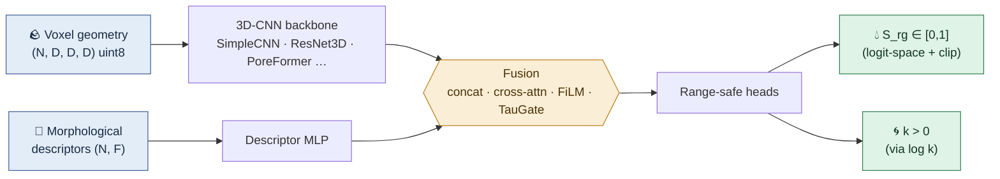
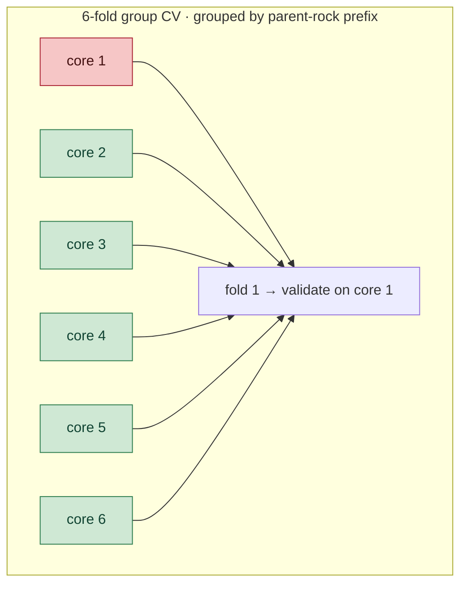

<div align="center">


# Digital‑Rock‑SrgNet

#### 🧠 3D‑CNN surrogate models for **residual‑gas‑saturation** prediction from digital rock cores

*Learn two‑phase‑flow outcomes directly from pore‑scale voxel geometry —<br/>replacing minutes‑to‑hours of Lattice‑Boltzmann (LBM) and pore‑network (Stokes) simulation with a millisecond forward pass.*

<br/>

[](LICENSE)
[](https://www.python.org/)
[](https://pytorch.org/)
[](https://lightning.ai/)
[](#-project-status)

<br/>

```
   ╭──────────────╮      ╭───────────────╮      ╭──────────────────╮
   │  3D pore     │      │   3D‑CNN  +   │      │  range‑safe head │
   │  geometry    │ ───▶ │   descriptor  │ ───▶ │   S_rg ∈ [0,1]   │
   │  (voxels)    │      │   fusion      │      │   k  >  0        │
   ╰──────────────╯      ╰───────────────╯      ╰──────────────────╯
        input                 surrogate                 physics
```

</div>

<div align="center">
  <sub><b>⚡ ms inference</b></sub> &nbsp;•&nbsp;
  <sub><b>🔬 physics‑consistent outputs</b></sub> &nbsp;•&nbsp;
  <sub><b>🧪 leakage‑safe cross‑validation</b></sub> &nbsp;•&nbsp;
  <sub><b>🏗️ 15‑model zoo</b></sub>
</div>

---

## 📑 Contents

- [Overview](#-overview)
- [How it works](#-how-it-works)
- [Method highlights](#-method-highlights)
- [Model zoo](#-model-zoo)
- [Repository layout](#-repository-layout)
- [Quick start](#-quick-start)
- [Dataset schema](#️-dataset-not-included)
- [Project status](#-project-status)
- [Citation](#-citation)
- [License](#-license)

---

## ✨ Overview

Predicting the **residual gas saturation** (`S_rg ∈ [0, 1]`) and **permeability** (`k`) of porous
rock normally requires running a full physical simulator — LBM for two‑phase flow, OpenPNM /
Stokes for single‑phase flow — on every voxelized core, costing minutes to hours **per sample**.

**Digital‑Rock‑SrgNet** replaces that simulator with a learned surrogate: a 3D convolutional
network ingests the raw binary pore geometry (plus a vector of morphological descriptors) and
predicts the flow target **end‑to‑end in milliseconds**.

This repository ships the **model architectures, dataset interface, and a fully reproducible
cross‑validation training loop** used to benchmark a family of 3D‑CNN / attention / transformer
surrogates on a 360‑sample digital‑rock dataset.

> [!NOTE]
> **Why this is hard.** With only ~360 cores and a volumetric input, the model is heavily
> over‑parameterized relative to the data. The entire study is therefore built around
> **leakage‑safe, leave‑one‑rock‑out cross‑validation** and aggressive regularization rather than
> a single train/test split.

---

## 🔧 How it works



**Leave‑one‑rock‑out cross‑validation** — sub‑volumes cut from the same parent core are strongly
correlated, so a naïve random split leaks information. We group by **parent‑rock id** and hold out
one whole core at a time:



---

## 🔬 Method highlights

| 🎯 Design choice | Why it matters |
|---|---|
| **Voxel CNN + descriptor MLP, late fusion** | fuses raw 3D geometry with cheap morphological features (porosity, tortuosity, connectivity …) |
| **Physical‑range outputs** | `S_rg` is trained in logit space and clipped to `[0, 1]`; permeability via `log k` guarantees `k > 0` |
| **Leave‑one‑rock‑out CV** | grouping by **parent‑rock prefix** prevents train/val leakage between correlated sub‑volumes |
| **Z‑axis‑aware augmentation** | the pore network is percolated along Z, so augmentation rotates/mirrors only the X–Y plane, never the percolation axis |
| **Train‑set‑only normalization** | feature mean/std are computed on the training fold alone — leakage‑safe by construction |

---

## 🧩 Model zoo

Every model shares the signature `forward(voxel, features) -> prediction` and is selectable via
`--model`.

| `--model` | Class | Backbone | Fusion | Notes |
|---|---|---|---|---|
| `phi` | `PhiOnlyBaseline` | — | — | descriptor‑only MLP baseline (no voxels) |
| `simple` | `SimpleSrgNet` | 3‑layer 3D‑CNN | concat | ⭐ **main lightweight baseline** |
| `simple_sigmoid` | `SimpleSrgNetSigmoid` | 3‑layer 3D‑CNN | concat | + sigmoid head |
| `simple_taugate` | `SimpleTauGateNet` | 3‑layer 3D‑CNN | concat + TauGate | physics‑guided gating |
| `resnet18_concat` | `ResNetSrgNet` | 3D‑ResNet18 | concat | deeper backbone |
| `resnet18_crossattn` | `ResNetSrgNet` | 3D‑ResNet18 | cross‑attention | |
| `resnet18_film` | `ResNetSrgNet` | 3D‑ResNet18 | FiLM | feature‑wise modulation |
| `resnet10_tiny_crossattn` | `ResNet10Tiny` | tiny 3D‑ResNet10 | cross‑attention | low‑parameter |
| `ms_porenet_crossattn` | `MSPoreNet` | multi‑scale Inception‑3D | cross‑attention | |
| `porecoat_crossattn` | `PoreCoAt` | conv + attention (CoAtNet‑style) | cross‑attention | |
| `poreformer_crossattn` | `PoreFormer` | 3D vision transformer | cross‑attention | |
| `poreflownet` | `PoreFlowNet` | 3D‑ResNet | cross‑attention | 🔱 **dual‑head** (`S_rg` + `log k`) + TauGate |
| `poreflownet_no_taugate` | `PoreFlowNet_NoTauGate` | 3D‑ResNet | cross‑attention | ablation |
| `poreflownet_no_crossattn` | `PoreFlowNet_NoCrossAttn` | 3D‑ResNet | concat | ablation |
| `voxel_only_cnn` | `VoxelOnlyCNN` | 3D‑CNN | — | geometry‑only (no descriptors) |

> Reusable building blocks in [`models_3d.py`](models_3d.py): `BasicBlock3D`, `ResNet3D`,
> `ConcatFusion`, `CrossAttnFusion`, `FiLMFusion`, `TauGate`, and Inception / MBConv / transformer 3D blocks.

---

## 📦 Repository layout

```
digital-rock-srg-net/
├── 🧱 model.py          # lightweight baselines: SimpleSrgNet, PhiOnlyBaseline, TauGate variants
├── 🏗️  models_3d.py      # the full 3D model zoo + fusion blocks + PoreFlowNet
├── 🗃️  data.py           # dataset interface, leave-one-rock-out splitting, leakage-safe stats
├── 🚂 train.py          # 6-fold cross-validation training / evaluation entry point
├── 📋 requirements.txt
├── 📜 LICENSE
└── 📖 README.md
```

---

## 🚀 Quick start

```bash
git clone https://github.com/YonganZhang/digital-rock-srg-net.git
cd digital-rock-srg-net
pip install -r requirements.txt

# Train + 6-fold leave-one-rock-out evaluation of the main baseline
python train.py --data data/processed/voxel_128.npz --model simple --epochs 80 \
                --scheduler cosine --augment --gpu 0

# Descriptor-only baseline for comparison
python train.py --data data/processed/voxel_128.npz --model phi --epochs 30 --gpu 0
```

Per‑fold and aggregate `R² / MAE / RMSE` are printed to stdout and written to
`runs/p1_<model>_<tag>.json`.

<details>
<summary><b>🎛️ Command‑line options</b></summary>

<br/>

| Flag | Default | Description |
|---|---|---|
| `--data` | `data/processed/voxel_128.npz` | path to the cached dataset (see schema below) |
| `--model` | `simple` | architecture (see model zoo) |
| `--epochs` | `30` | training epochs per fold |
| `--batch-size` | `8` | mini‑batch size |
| `--gpu` | `1` | CUDA device index |
| `--augment` | off | enable X–Y rotation/mirror augmentation |
| `--scheduler` | `none` | `none` or `cosine` |
| `--target-transform` | `logit` | `logit` (range‑safe) or `none` |
| `--tag` | `default` | suffix for the output json |

</details>

---

## 🗂️ Dataset (not included)

> [!IMPORTANT]
> The digital‑rock voxel data and morphological descriptors are part of an ongoing study and are
> **not distributed with this repository.** This repo open‑sources the **modeling code only.**

`data.py` expects a single cached `.npz` (built offline) with the following arrays:

| Key | Shape | Dtype | Meaning |
|---|---|---|---|
| `voxel` | `(N, D, D, D)` | `uint8` | binary pore geometry (`D` = 128 or 256), kept as `uint8` in RAM |
| `features` | `(N, F)` | `float32` | morphological descriptors (porosity, tortuosity, connectivity, …) |
| `Srg` | `(N,)` | `float32` | residual gas saturation ∈ [0, 1] — **primary target** |
| `K` | `(N,)` | `float32` | permeability > 0 |
| `logK` | `(N,)` | `float32` | `log10(K)` — regression target for `k` |
| `sample_id` | `(N,)` | str | per‑sub‑volume id |
| `prefix` | `(N,)` | str | **parent‑rock id** — the grouping key for CV |
| `feature_names` | `(F,)` | str | descriptor names |

To use your own data, produce an `.npz` with these keys and point `--data` at it.

---

## 📊 Project status

> [!WARNING]
> This is **active research code** accompanying a paper in preparation — not a frozen, pretrained
> production model.

Findings so far:

- 🥇 The strongest configuration to date is `SimpleSrgNet` (lightweight 3‑layer 3D‑CNN, cosine LR,
  X–Y augmentation), reaching **R² ≈ 0.49** under leave‑one‑rock‑out CV.
- 📉 Deeper backbones (3D‑ResNet18, transformers) **did not** outperform the lightweight baseline
  at this sample size — a recurring small‑data lesson, documented honestly in the study.
- 🚫 No pretrained weights are shipped; train from scratch with your own data.

We release the architecture family so others can reproduce these comparisons and build on the
benchmark.

---

## 📖 Citation

A paper describing this work is in preparation. Until it appears, please cite the repository:

```bibtex
@software{wang_digital_rock_srgnet_2026,
  author  = {Wang, Peng and collaborators},
  title   = {Digital-Rock-SrgNet: 3D-CNN surrogate models for residual-gas-saturation
             prediction from digital rock cores},
  year    = {2026},
  url     = {https://github.com/YonganZhang/digital-rock-srg-net}
}
```

---

## 📜 License

Released under the [MIT License](LICENSE). The accompanying dataset is **not** covered by this
license and is not distributed here.

<div align="center">
<br/>
<sub>Built for reproducible digital‑rock physics · contributions & issues welcome 🤝</sub>
</div>
